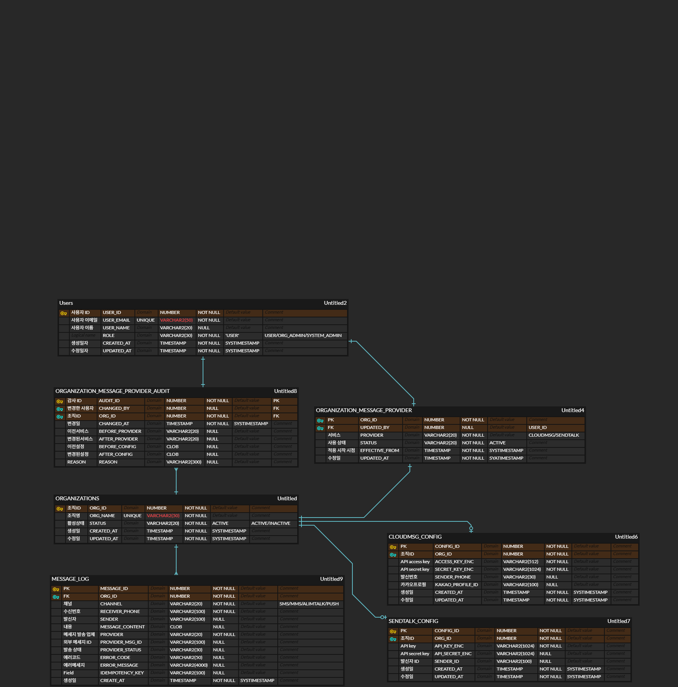

# Message Provider System Design

기존 CloudMsg 단일 메시지 발송 구조를  
조직별로 서로 다른 메시지 Provider를 사용할 수 있는 구조로 확장하기 위한 설계 문서입니다.

현재 시스템은 CloudMsg 하나의 서비스만 사용하고 있기 때문에  
새로운 메시지 서비스(SendTalk)를 도입하려면 Provider를 유연하게 선택할 수 있는 구조가 필요합니다.

이 문서에서는 멀티 Provider 구조를 지원하기 위한 서버 설계와 데이터 모델을 정리했습니다.

## Part A 서버 설계

---

# 1. Problem

기존 메시지 발송 시스템은 모든 메시지를 CloudMsg를 통해 전송하는 구조입니다.

하지만 다음과 같은 요구사항이 추가되었습니다.

- SendTalk 메시지 서비스 신규 도입
- 조직별로 다른 메시지 Provider 사용 가능
- 메시지 발송 이력 관리
- Provider 설정 변경 이력 관리

즉, **단일 Provider 구조에서 멀티 Provider 구조로 확장**이 필요한 상황입니다.

---

# 2. Architecture

메시지 Provider를 유연하게 확장하기 위해 Provider Router 구조를 사용했습니다.

```text
Client
   │
   ▼
Message API
   │
   ▼
Message Service
   │
   ├── organizations
   ├── organization_message_provider
   ├── cloudmsg_config
   └── sendtalk_config
   │
   ▼
Provider Router
   │
   ├── CloudMsg Provider → CloudMsg API
   └── SendTalk Provider → SendTalk API
   │
   ▼
message_log 기록
```
메시지 발송 요청이 들어오면
조직의 Provider 설정을 확인한 뒤 해당 Provider 구현체를 선택하여 메시지를 전송합니다.

이 구조를 사용하면 향후 다른 메시지 Provider가 추가되더라도
Provider 구현체만 추가하면 되기 때문에 확장성이 좋아집니다.

---

# 3. Database Design



주요 테이블은 다음과 같습니다.

- organizations
  조직(고객사) 정보를 저장

- organization_message_provider
  조직이 현재 사용 중인 메시지 Provider를 관리

- cloudmsg_config
  CloudMsg API 연동을 위한 설정 정보

- sendtalk_config
  SendTalk API 연동을 위한 설정 정보

- message_log
  실제 메시지 발송 기록

- provider_audit
  Provider 설정 변경 이력

Provider 설정을 별도의 테이블로 분리하여
조직별 Provider 설정을 유연하게 관리할 수 있도록 설계했습니다.

---

# 4. Message Flow

메시지 발송 과정은 다음과 같은 흐름으로 진행됩니다.

1. 메시지 발송 요청
2. organization_message_provider 조회
3. Provider 선택
4. Provider API 호출
5. message_log 저장
   (발송 provider, 외부 메시지 ID, 상태 기록)
   
이 과정을 통해 어떤 Provider로 메시지가 전송되었는지 추적할 수 있습니다.

---

# 5. Technical Decisions

## Provider Abstraction
멀티 Provider 지원을 위해 Provider Router 구조를 사용했습니다.

각 Provider는 동일한 인터페이스를 구현하도록 설계하여
Provider가 추가되더라도 기존 로직을 크게 수정하지 않고 확장할 수 있도록 했습니다.

## Provider Config 분리

Provider마다 필요한 설정 정보가 서로 다르기 때문에
단일 설정 테이블 대신 Provider별 설정 테이블을 분리했습니다.

- cloudmsg_config
- sendtalk_config

이 방식은 불필요한 NULL 컬럼을 줄이고
Provider 확장 시에도 구조를 단순하게 유지할 수 있다는 장점이 있습니다.

---

# 6. 리스크

## 외부 API 장애
메시지 Provider는 외부 API이기 때문에 장애가 발생할 수 있습니다.

대응 방안

- 메시지 발송 상태를 `message_log` 테이블 기록
- 재시도 전략 적용

## 중복 메시지
네트워크 오류나 재시도 과정에서 동일한 메시지가 중복 발송될 가능성이 있습니다.

대응

- `idempotency_key`를 사용하여 중복 요청을 방지했습니다.

---

# Part B. 화면 설계

## 1. 목표

조직 관리자는 관리자 설정 화면에서 메시지 Provider를 변경할 수 있도록 설계하였습니다.

지원되는 Provider

- CloudMsg

- SendTalk

UI 설계 목표

- Provider 설정을 직관적으로 관리

- API 설정 오류 방지

- 운영자의 실수 방지

- Provider 변경 이력 관리

---

## 2. 화면 흐름 (User Flow)

Provider 설정 과정은 다음과 같은 흐름으로 진행됩니다.

```text
Organization Admin
      │
      ▼
Settings 메뉴 진입
      │
      ▼
Message Provider 설정 화면
      │
      ▼
현재 Provider 확인
      │
      ▼
Provider 선택
      │
      ▼
Provider 설정 입력
      │
      ▼
API 연결 테스트
      │
      ▼
  설정 저장
```
관리자는 먼저 현재 사용 중인 Provider를 확인한 후 새로운 Provider를 선택할 수 있습니다.
Provider 설정 값 입력 후 연결 테스트를 통해 API 인증 정보를 검증하고 설정을 저장하도록 구성하였습니다.

---
  
## 3. Provider Settings UI
관리자는 다음과 같은 화면에서 메시지 Provider를 설정할 수 있도록 설계하였습니다.

```text
┌──────────────────────────────────────────────┐
│ Message Provider Settings                    │
├──────────────────────────────────────────────┤

Current Provider
[ CloudMsg ]

------------------------------------------------

Select Provider

(●) CloudMsg
( ) SendTalk

------------------------------------------------

Provider Configuration

Access Key        [ ********************* ]
Secret Key        [ ********************* ]
Sender Phone      [ 01012345678 ]
Kakao Profile ID  [ my-kakao-channel ]

[ Test Connection ]

------------------------------------------------

[ Cancel ]                     [ Save Settings ]

└──────────────────────────────────────────────┘
```
화면 상단에는 현재 사용 중인 Provider를 표시하여
운영자가 현재 설정 상태를 쉽게 확인할 수 있도록 하였습니다.

Provider는 Radio Button 방식으로 선택할 수 있도록 하였으며
선택된 Provider에 따라 설정 입력 폼이 변경되도록 구성하였습니다.

---

## 4. Provider 설정 방식

Provider마다 필요한 API 설정 값이 다르기 때문에
Provider 선택에 따라 입력 필드가 동적으로 변경되도록 설계하였습니다.

### CloudMsg 설정

입력 항목

- Access Key

- Secret Key

- Sender Phone

- Kakao Profile ID

---

### SendTalk 설정

입력 항목

- API Key

- API Secret

- Sender ID

Provider별 설정을 분리함으로써
사용자가 불필요한 설정 값을 입력하지 않도록 구성하였습니다.

---

## 5. UI 설계 결정 사항

### Provider 선택 방식

Provider 선택 방식은 Dropdown 대신 Radio Button을 사용하였습니다.

Provider 수가 많지 않기 때문에
Radio Button이 현재 선택 상태를 더 명확하게 보여줄 수 있다고 판단하였습니다.

또한 관리자 설정 화면에서는 선택 가능한 옵션을
직접 표시하는 방식이 사용자의 실수를 줄이는데 도움이 된다고 판단하였습니다.

---

### API 연결 검증

Provider 설정에서는 잘못된 API 인증 정보가 입력될 가능성이 있기 때문에
설정 저장 전에 연결 테스트 기능을 제공하도록 설계하였습니다.
```text
[Test Connection]
```
이 버튼을 통해 실제 Provider API 호출을 수행하여
입력한 인증 정보가 정상적으로 동작하는지 확인할 수 있도록 하였습니다.

검증이 실패할 경우 설정 저장을 제한하고 오류 메시지를 표시하도록 구성하였습니다.

---

### Provider 변경 확인

Provider 변경은 메시지 발송 방식에 영향을 줄 수 있기 때문에
설정을 저장하기 전에 확인 팝업을 표시하도록 설계하였습니다.

```text
You are about to change the message provider.

Existing messages will continue using the previous provider.
New messages will use the selected provider.

Continue?

[ Cancel ] [ Confirm ]
```

이를 통해 운영자가 실수로 Provider를 변경하는 상황을 방지할 수 있도록 하였습니다.

---

## 6. 예외 / 엣지 케이스

### 잘못된 API Key 입력
관리자가 잘못된 API 인증 정보를 입력할 수 있습니다.

이 경우 Test Connection 단계에서 연결 검증이 실패하며
다음과 같은 오류 메시지를 표시하도록 구성하였습니다.

예
```text
Connection failed
Invalid API credentials
```

---

### 필수 입력 누락

Provider 설정에 필요한 필수 입력 값이 비어 있는 경우
입력 검증을 통해 설정 저장을 제한하도록 구성하였습니다.

예시
```text
API Key is required
```

---

### Provider 변경 중 메시지 발송

Provider 변경 시 이미 발송 중인 메시지가 있을 수 있습니다.

이 경우 기존 메시지는 이전 Provider를 사용하여 처리하고
Provider 변경 이후 생성된 메시지부터 새로운 Provider를 사용하도록 설계하였습니다.

---

### Provider 설정 유지

Provider 변경 시 기존 Provider 설정은 삭제하지 않고 유지하도록 설계하였습니다.

예를 들어 CloudMsg에서 SendTalk로 Provider를 변경하더라도
CloudMsg 설정 정보는 그대로 보존됩니다.

이를 통해 Provider를 다시 변경할 경우 기존 설정을 재사용할 수 있도록 하였습니다.

---

## 7. 설정 변경 이력 관리

Provider 설정이 변경될 경우 변경 이력을 기록하도록 설계하였습니다.

```text
organization_message_provider_audit
```

기록 정보

- organization_id

- before_provider

- after_provider

- changed_by

- changed_at

이 정보는 provider_audit 테이블에 저장되며
운영자가 설정 변경 이력을 확인할 수 있도록 하였습니다.

---

## 8. 사용자 피드백

설정 저장 결과에 따라 다음과 같은 메시지를 사용자에게 제공하도록 설계하였습니다.

설정 저장 성공

```text
Provider settings updated successfully
```

API 인증 실패

```text
Connection failed.
Please verify API credentials.
```

---

## 9. 기대 효과

이 UI 설계를 통해

- 조직별 메시지 Provider 관리 가능

- API 설정 오류 방지

- 운영 실수 최소화

- Provider 변경 이력 추적 가능


---


# AI 활용

본 과제 수행 과정에서 화면 설계 및 예외 상황을 검토하기 위해 AI를 활용하였습니다.
AI는 UI 설계 방향과 예외 상황을 탐색하는 참고 도구로 사용하였고, 최종 설계 결정은 요구사항 분석을 기반으로 직접 판단했습니다.

## 1. Provider 설정 화면 구조 설계
사용 프롬프트

```text
B2B SaaS 서비스에서 조직 관리자가 메시지 전송 provider를 설정하는
관리자 UI를 설계하려고 합니다.

지원 provider는 CloudMsg와 SendTalk 두 가지이며
API key, sender 정보 등 provider별 설정이 필요합니다.

운영자가 실수할 가능성을 고려하여
provider 설정 화면의 UI 구조와 주요 구성 요소를 제안해주세요.
```

### AI 응답 활용

AI는 다음과 같은 UI 구성 요소를 제안했습니다.

- 현재 Provider 표시

- Provider 선택 영역

- Provider 설정 입력 영역

- 연결 테스트 기능

- 설정 저장 기능

이를 참고하여 Provider 설정 화면을 다음과 같은 구조로 설계하였습니다.

- Current Provider 표시

- Provider 선택 (Radio Button)

- Provider 설정 입력

- Test Connection

- Save Settings

---

## 2. Provider 설정 UI 방식 결정
사용 프롬프트

```text
관리자 설정 화면에서 메시지 provider를 선택할 때
Dropdown과 Radio Button 중 어떤 UI 방식이 더 적절한지
장단점을 비교해주세요.

Provider는 CloudMsg와 SendTalk 두 가지입니다.
```

### AI 응답 활용

AI는 다음과 같은 의견을 제시했습니다.

- Provider 수가 적은 경우 Radio Button이 가시성이 높음

- 현재 선택 상태를 명확하게 표시 가능

- 운영 UI에서 실수 방지에 유리

이를 참고하여 Provider 선택 UI를 Radio Button 방식으로 설계하였습니다.

---

## 3. 예외 상황 검토
사용 프롬프트

```text
메시지 provider 설정을 변경하는 관리자 UI에서
발생할 수 있는 운영 실수나 예외 상황에는 어떤 것들이 있을까요?

예를 들어 API key 오류, provider 변경 중 메시지 발송 등
운영 환경에서 발생 가능한 문제를 정리해주세요.
```

### AI 응답 활용

AI는 다음과 같은 예외 상황을 제안했습니다.

- 잘못된 API Key 입력

- 필수 설정 값 누락

- Provider 변경 중 메시지 발송

- Provider API 장애

이를 참고하여 다음 대응 방안을 UI 설계에 반영하였습니다.

- API 연결 테스트 기능

- 필수 입력 값 validation

- Provider 변경 confirmation

- 오류 메시지 표시

---

AI는 UI 설계 아이디어와 예외 상황 탐색을 위해 활용되었으며
최종 설계는 요구사항 분석을 기반으로 직접 결정했습니다.

---

기존 CloudMsg 단일 Provider 구조를 유지하면서도
향후 다른 메시지 Provider가 추가될 가능성을 고려하여 확장 가능한 구조로 설계하였습니다.
